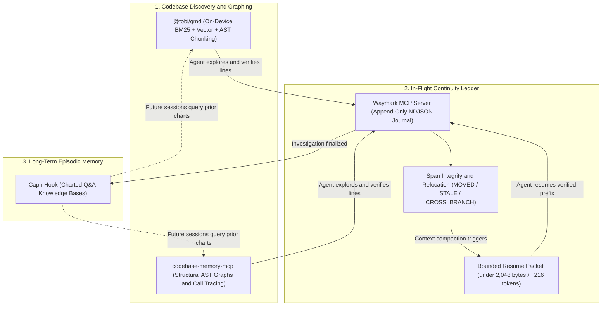

# Waymark: In-Flight Continuity MCP Server for AI Coding Agents

> **Empirical Continuity Benchmark:** Across multi-hop coding investigations, an agent recovering from Waymark used **96.8% fewer recovery tokens** vs. Cold Exploration (~216 tokens vs. 6,675 avg cold tokens) and **85.2% fewer recovery tokens** vs. Indexed Retrieval (~216 tokens vs. 1,458 avg indexed tokens) with **100% precision on relocated spans** and **zero redundant file re-inspections**--paying for itself immediately on the 1st compaction. (Reproduce via `npm run benchmark`).

---

## Don't Lose Your Place When Context Compaction Hits

When an AI coding agent is 6 hops deep tracing a complex issue across 5 files, context compaction eventually triggers:
- **Without Waymark (Cold Exploration)**: In-flight discoveries are wiped. The agent re-reads the entire repository from scratch, wastes tens of thousands of tokens re-deriving the same files, or hallucinates line numbers.
- **Without Waymark (Indexed Retrieval alone)**: Even with structural graph or semantic indexers, the agent re-runs graph queries, re-fetches 3-5 candidate functions, and loses the specific causal inferences made before compaction.
- **With Waymark (In-Flight Continuity)**: The agent calls `waymark_resume` and immediately picks up from its verified breadcrumb trail in a single step (<820 bytes / ~216 tokens).

---

## Architecture: The Clean Separation of Concerns

A modern AI coding workflow requires three distinct architectural layers:

1. **Discovery & Structural Search (Stateless):**
   - **`@tobi/qmd`**: Tobi Lütke's on-device hybrid search engine combining SQLite FTS5 (BM25 keyword search) with local vector embeddings and AST-aware code chunking.
   - **`codebase-memory-mcp` (CBM)**: DeusData's high-performance native-C graph engine for structural call-graph tracing (`trace_path`) and Cypher-like queries.
   - *Role:* Answers questions like *"Where is authentication handled?"* and returns candidate code snippets (1,500--4,000 tokens).
2. **In-Flight Continuity Ledger (Stateful & Compact):**
   - **`paragon-ux/waymark`**: A dependency-free, append-only NDJSON event journal.
   - *Role:* Answers *"What have I proven so far in this task?"* Validates exact line spans, tracks relocated blocks (`MOVED`), isolates stale evidence (`STALE`), and outputs a bounded resume packet (<2,048 bytes / ~216 tokens) upon context compaction.
3. **Long-Term Episodic Memory (Cross-Session):**
   - **`CyrusNuevoDia/capn-hook`**: Durable Q&A repository memory.
   - *Role:* Stores finalized, human- or agent-verified conclusions for future sessions.



> [!NOTE]
> **Clarification on CBM and QMD:** Waymark does **not** bundle, vendor, or internalize `codebase-memory-mcp` (CBM) or `@tobi/qmd`. Waymark remains strictly **zero-dependency**. In our benchmarks and dynamic experiments, CBM and QMD were used externally to represent structural codebase graphing and AST-level discovery (rather than a naive cold-start file read), demonstrating that even with advanced code graphs, agents still require an in-flight continuity ledger to survive context compaction without incurring repeated re-discovery token penalties.

### Deep-Dive Guides:
- **[QMD Architecture & Retrieval Guide](docs/QMD-AND-DISCOVERY.md)**: On-device hybrid search, AST chunking, and division of labor.
- **[CBM (Codebase Memory) Integration Guide](docs/INTEGRATION-CBM.md)**: Pairing DeusData's structural graph engine with Waymark.
- **[Multi-Agent Harness Compatibility Guide](docs/HARNESS-COMPATIBILITY.md)**: Out-of-context lifecycle hooks (`waymark-hook`) and rules for Claude Code, Cursor, Codex, and Antigravity.
- **[Audit and Optimization Report](docs/AUDIT-AND-OPTIMIZATION-REPORT.md)**: Full audit ledger and empirical benchmark analysis.

---

## The Proactive Agent Directive

Waymark installs as a native MCP server and provides a single proactive 4-rule directive (available via `waymark://context` resource, `waymark_investigate` prompt, or harness rule):

```text
1. Before searching codebase, query capn_ask to reuse charted knowledge.
2. While tracing code, save verified hops via waymark_note (path, line range, inference).
3. After context compaction, call waymark_resume to pick up your exact verified breadcrumb trail.
4. When finished, seal with waymark_complete to archive findings and chart into Capn.
```

That directive is the entire integration: no forced middleware, no complex scaffolding. The model reads it and decides.

---

## Hard Integrity Guarantees (Why It's Not Just a Notepad)

Waymark actively protects the agent against stale evidence and hallucinations:

1. **Exact & Relocated Span Verification (`MOVED` / `FRESH`):**
   - Each hop records the exact file path, line range, SHA-256 hash, and structural signature.
   - If other lines are added or removed in the file, Waymark automatically relocates the span and updates the range (`MOVED`).
2. **Fail-Closed Stale Quarantine (`STALE`):**
   - If code inside a recorded hop is modified, deleted, or ambiguous, Waymark marks the hop `STALE` and halts continuation.
   - The `verifiedThrough` index ensures the agent **only trusts hops up to the first valid hop**, preventing cascade errors.
3. **Branch & Commit Drift Protection (`CROSS_BRANCH`):**
   - If Git branch or HEAD changes mid-investigation (e.g., rebase or branch switch), Waymark halts with `CROSS_BRANCH` instead of mixing evidence across versions.
4. **Crash-Proof Immutable Journal:**
   - Append-only NDJSON event journal with filesystem locking, atomic writes, and fsync. Zero runtime npm dependencies.

---

## Model Context Protocol (MCP) Configuration

Waymark runs as a native `stdio` JSON-RPC 2.0 MCP server with **zero runtime npm dependencies**.

You can run Waymark as a standalone continuity server, run Capn as a dedicated long-term memory server, or run the unified binary.

### Option 1: Standalone In-Flight Continuity (Recommended)
Add to your client config (`mcpServers` in Claude Desktop, Cursor, Codex, Gemini, or Antigravity):

```json
{
  "mcpServers": {
    "waymark": {
      "command": "node",
      "args": ["<path-to-waymark>/dist/src/mcp/waymarkIndex.js"]
    }
  }
}
```

### Option 2: Modular Continuity + Long-Term Memory
```json
{
  "mcpServers": {
    "waymark": {
      "command": "node",
      "args": ["<path-to-waymark>/dist/src/mcp/waymarkIndex.js"]
    },
    "capn": {
      "command": "node",
      "args": ["<path-to-waymark>/dist/src/mcp/capnIndex.js"]
    }
  }
}
```

### Option 3: Unified Server (Both in One Process)
```json
{
  "mcpServers": {
    "waymark": {
      "command": "node",
      "args": ["<path-to-waymark>/dist/src/mcp/index.js"]
    }
  }
}
```

---

## Available MCP Toolsets

### In-Flight Continuity Server (`waymark`)
- **`waymark_init`**: Initialize or configure the store profile (`recording`, `capn-cli`, `none`).
- **`waymark_status`**: Retrieve current active trajectory status (`NONE`, `STAGED`, `STALE`) and step count.
- **`waymark_begin`**: Start a new durable in-flight code investigation for a question.
- **`waymark_note`**: Record a verified code hop (`path`, `label`, `start_line`, `end_line`, `inference`).
- **`waymark_check`**: Verify worktree integrity against current Git HEAD and detect line relocations.
- **`waymark_resume`**: Retrieve the bounded compact-resume packet after context compaction.
- **`waymark_complete`**: Seal the active trajectory, archive the journal, and record findings.
- **`waymark_abandon`**: Discard an active trajectory.
- **Resources & Prompts**: `waymark://context`, `waymark://status`, and `waymark_investigate`.

### Capn Long-Term Memory Server (`capn-mcp`)
- **`capn_ask`**: Query Capn's charted memory for previously answered questions (returns `result` payload on hits).
- **`capn_chart`**: Directly chart a question, answer, and referenced files into Capn.
- **Resources**: `capn://status`.

---

## Complete MCP Agent Workflow Example

```text
[capn_ask] -> [waymark_begin] -> [waymark_note]* -> (Compaction) -> [waymark_check] -> [waymark_resume] -> [waymark_complete]
```

### 1. Check Existing Knowledge
```json
// Tool Call: capn_ask
{ "question": "How does webhook authentication verify signatures?" }

// Response:
{ "waymark": 1, "kind": "ask", "status": "miss", "matches": [] }
```

### 2. Start Active Investigation
```json
// Tool Call: waymark_begin
{ "question": "How does webhook authentication verify signatures?" }

// Response:
{ "waymark": 1, "kind": "begin", "ok": true, "id": "4b8f...2a", "question": "..." }
```

### 3. Record Evidence Hops
```json
// Tool Call: waymark_note
{
  "trajectory_id": "4b8f...2a",
  "path": "src/auth/verifier.ts",
  "label": "hmac-sha256-check",
  "start_line": 24,
  "end_line": 42,
  "inference": "Verifies HMAC-SHA256 signature using timing-safe comparison against secret header."
}
```

### 4. Post-Compaction Recovery
When context compaction triggers, recover the verified trail without re-reading the codebase:
```json
// Tool Call: waymark_resume
{}

// Response:
{
  "waymark": 1,
  "kind": "compact-resume",
  "status": "STAGED",
  "trajectoryId": "4b8f...2a",
  "verifiedThrough": 1,
  "totalSteps": 2,
  "hops": [
    { "index": 0, "path": "src/routes/webhook.ts", "label": "entry-route", "status": "FRESH" },
    { "index": 1, "path": "src/auth/verifier.ts", "label": "hmac-sha256-check", "status": "FRESH" }
  ],
  "nextAction": "continue-from-verified-hop"
}
```

### 5. Seal & Archive Trajectory
When finished, seal the trajectory. Waymark archives the journal and records findings:
```json
// Tool Call: waymark_complete
{
  "trajectory_id": "4b8f...2a",
  "answer": "Webhooks verify SHA-256 HMAC signatures via timing-safe buffer comparison in verifier.ts."
}
```

---

## Explicit Note Discipline (A Feature, Not a Bug)

Waymark requires calling `waymark_note` for every meaningful hop:
- **Noise Filtering**: Automated scratchpads capture exploratory dead ends. Forcing explicit hops guarantees that only verified, reasoned code discoveries survive compaction.
- **Strict Size Bounds**: Labels are capped at 120 characters and inferences at 160 characters to keep resume packets strictly under 2,048 UTF-8 bytes.

---

## When Waymark is Worth It vs. When It's Overkill

Waymark is engineered for deep code investigations where losing verified breadcrumbs across context compaction is costly. It is not meant for trivial tasks:

- **When Waymark is Worth It:**
  - Multi-hop investigations spanning 2+ files or complex call chains.
  - Tasks expected to exceed single-turn context limits (>10k tokens).
  - Shared repositories or active worktrees where code shifts mid-investigation.
  - Audit trails for complex security, refactoring, or bug reproductions.
- **When It is Overkill:**
  - Single-file edits or simple typo/syntax fixes.
  - Exploratory prototyping where in-flight continuity is disposable.
  - Tasks easily completed in a single conversational turn.

---

## Concurrency & Workspace Scoping

Waymark maintains **one active trajectory per repository store** (`.waymark/active.json`).
- If an agent starts a new trajectory with `waymark_begin` while another is active, the active pointer transitions to the new trajectory.
- For parallel multi-agent workflows (e.g. concurrent subagents exploring separate hypotheses), run each subagent in its own isolated Git worktree.

---

## Fail-Closed Relocation & Safety Guarantees

- **Relocation Window:** Waymark scans up to 2,000 lines in modified files to find exact relocated code blocks (`MOVED`).
- **Fail-Closed Boundary:** If code moves beyond 2,000 lines, is deleted, or matches multiple locations ambiguously, Waymark halts with `STALE`. Failing closed prevents agents from hallucinating deductions on misaligned code.

---

## Repository Map & Onboarding

- `src/mcp/`: Stdio JSON-RPC MCP servers (isolated `waymarkIndex.ts`, `capnIndex.ts`, and `index.ts`).
- `src/`: Dependency-free event journal, integrity scanner, and lock primitives.
- `test/`: 34 automated unit and integration tests.
- `scripts/benchmark.mjs`: Three-arm empirical continuity benchmark suite (Cold, Indexed, Waymark).
- `scripts/hooks/waymark-compact-hook.mjs`: Out-of-context post-compaction lifecycle hook for agent harnesses (`waymark-hook`).
- `schemas/`: Strict machine-output contracts.
- `control/`: Project state, ownership, and genuine compaction evidence ledger.

### Build & Verify
Requires Node.js 22+:

```bash
npm ci
npm run verify
npm run benchmark
```

The repository is MIT licensed with zero runtime npm dependencies.

---

## Internal / Operator Diagnostics (CLI)

The CLI (`dist/src/cli.js` / `waymark-operator`) is an internal diagnostic tool for test runners, lock recovery, and CI verification -- not the intended interface for end users. All agent workflows should use the MCP server.
